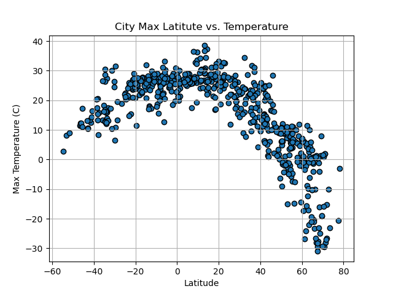

# Using APIs to Identify Weather Trends
#### Skills Used: API data pulls, Python, Pandas, Matplotlib, Linear Regression
#### Data Source: Open Weather Map API, Geoapify API
## Overview
In this challenge, we used Python requests and APIs to determine weather trends as we get closer to the equator.  We then took those findings to determine the ideal vacation location based on weather alone.

## Weather Analysis
First we looked at the weather trends in various different cities around the world.

- In our first step, we generated a list of cities to perform our analysis. 
- We then used the Open Weather Map API to pull data for each city, including latitude, longitude, country, and various weather details. 
- From there, we created various scatter plots to see the relationship between latitude and multiple other factors.
- Last, we split the data between the northern and southern hemisphere and calculated linear regressions on each data set for latitude vs. temperature, humidity, cloudiness, and wind speed.

Based on our analysis, the strongest correlations are between latitude and temperature - as you get closer to the equator (a latitude of zero), the greater the temperature. 
There were minimal correlation between latitude and the other variables. 

## Vacation Analysis
We then used our city data to determine the most ideal vacation spot based on weather conditions.

- We created a map of all of the cities in our original list, using humidiity as the size indicator.
- We then narrowed down our list of cities to only include cities that met a certain ideal weather vacation criteria. This criteria was:
    - Maximum temperature between 20 and 30 degrees Celsius.
    - Wind speed of under 4.5 m/s.
    - Cloudiness of 0%.
- This criteria gave us a final list of 20 cities.
- For these 20 cities, we then used the Geoapify API to pull hotel data for each city, trying to find the closest hotel to each city provided.
- We then regenerated our map to include only these 20 cities and to include the hotel information for each location.

## Conclusion
Based on our final analysis, there are 14 cities that meet our weather parameters and have a hotel nearby. These cities include:
- Saint George, Utah, United States
- Puerto Penasco, Mexico
- Abu Dhabi, United Arab Emirates
